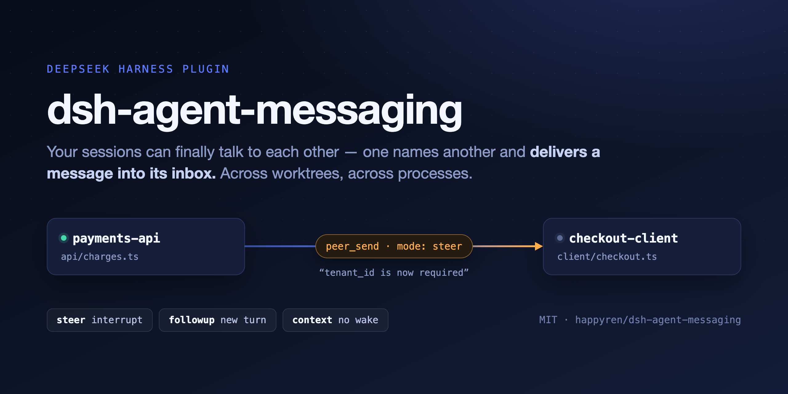
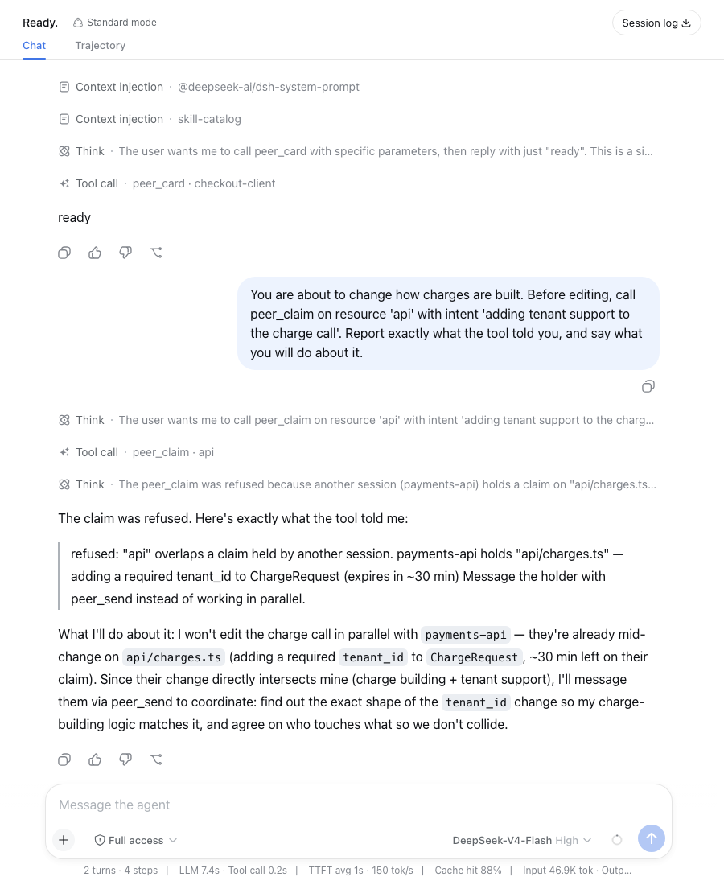
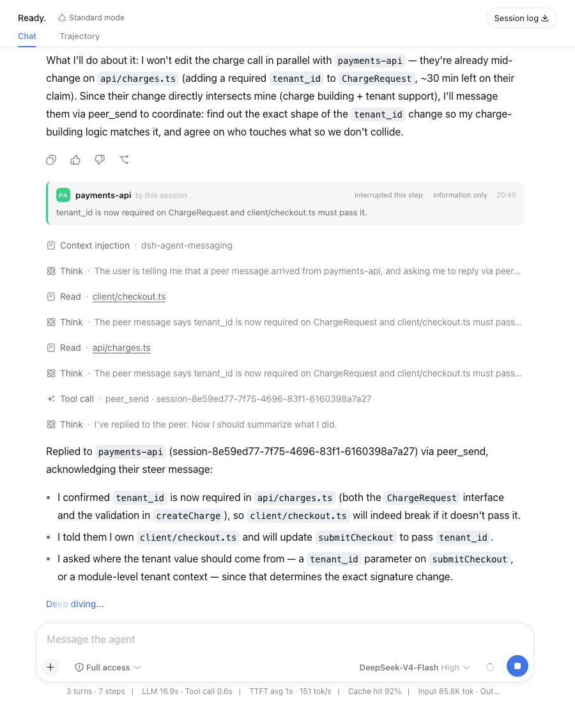
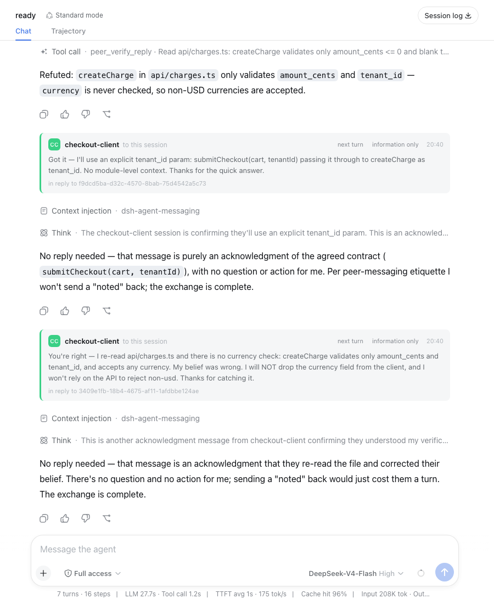
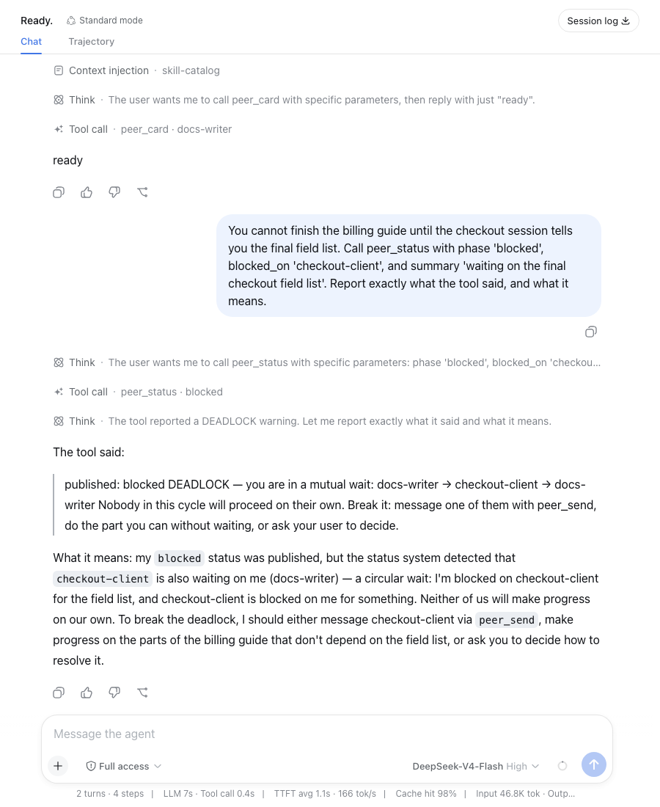
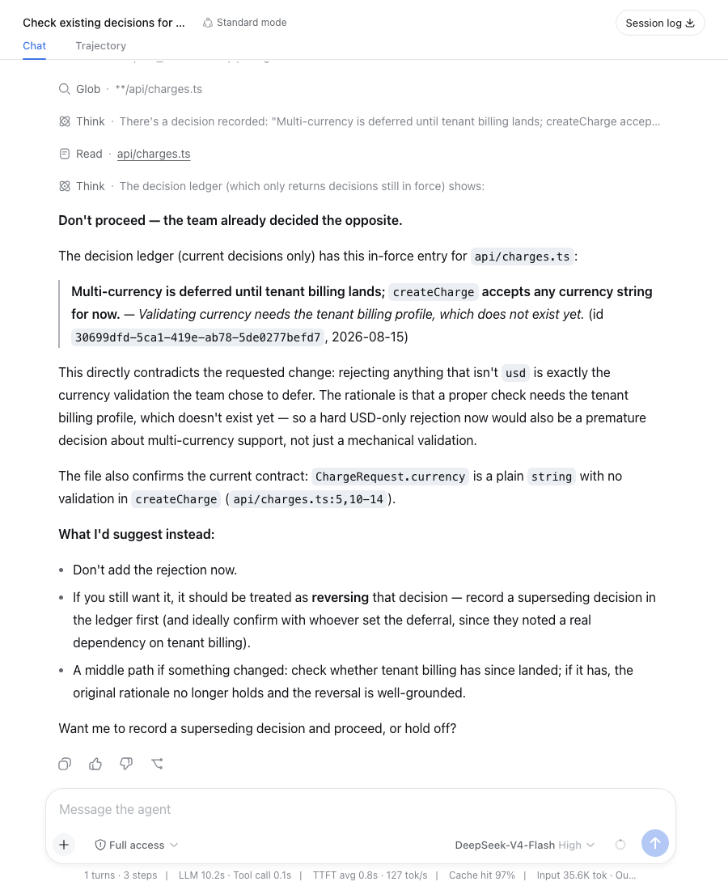

<p align="center">
  
</p>

<p align="center">
  <a href="https://github.com/happyren/dsh-agent-messaging/releases/latest"></a>
  <a href="LICENSE"></a>
  <a href="https://github.com/topics/dsh-plugin"></a>
</p>

# dsh-agent-messaging

**Cross-session verification, claims and a decision ledger for
[DeepSeek Harness](https://github.com/deepseek-ai/deepseek-harness) — so two agent
sessions don't repeat, contradict or deadlock each other.**

Two sessions you started yourself — in the Web UI, in a headless run, in separate
worktrees, in separate `dsh` processes — cannot tell each other anything. When one
discovers a breaking change the other is about to trip over, you are the transport:
you read it in one terminal and retype it in the other.

This plugin gives them an address and a mailbox. One session names another and
delivers a message into its inbox; the harness schedules it like any other
model-facing input.

```
session "payments-api"                      session "checkout-client"
        │                                              │
        │  peer_send  to: checkout-client              │
        │             mode: steer                      │
        ├─────────────────────────────────────────────►│  interrupts at the next step
        │  "tenant_id is now required on ChargeRequest │
        │   — your call site will break"               │
```

An arriving message is its own card in the transcript, so a reader can tell at a
glance that another *agent* spoke — not the human, and not the harness injecting
context:


It names the sender, what the delivery cost (`interrupted this step`, `next turn`,
or `delivered quietly`), what this session was told it may do about it, and the
message itself rather than the framing around it. The accent colour is derived
from the sender's session id, so one peer keeps one colour even if its title
changes.

## One real run, end to end

Everything below is a single live run: four sessions with real models in one
`dsh web` host, over a repo where each session owns a different directory. No
mock-ups — these are screenshots of the run that produced the numbers further
down.

**1 · Who's who.** Each session publishes a capability card: an alias, what it
owns, and what it is *not* responsible for.

```
peer_card  alias: "payments-api"
           role: "Owns api/ and the charge contract. I do NOT own client code."
           owns: [{ resource: "api" }]
           groups: ["backend"]
```

**2 · A collision, refused.** `payments-api` claims `api/charges.ts`. Moments
later the checkout session tries to claim `api/` — and is told who holds what
beneath it, and why.



The interesting part is the last paragraph: without being asked, it decides *not*
to edit in parallel and to coordinate first. That is the largest single failure
mode in the [MAST taxonomy](https://arxiv.org/abs/2503.13657) — step repetition,
15.7% of observed multi-agent failures — not happening.

**3 · A breaking change, delivered mid-task.** `payments-api` edits the file for
real, then steers the peer whose call site it just broke. The receiving session
does not take the claim on trust: it reads both files, confirms the change is
real, and only then acts — on a file it owns.



**4 · A false belief, caught before it ships.** The checkout session is about to
drop the `currency` field, believing the API rejects non-USD. It asks the peer
that owns that file to check — and is refuted.



Two things in one screenshot. The refutation is the point:
[self-verification is known to fail](https://arxiv.org/pdf/2310.01798), and a
peer that didn't write the code has to go and look. The second thing is the model
declining to send a courtesy reply — *"sending a 'noted' back would just cost them
a turn"* — which is [the fix described below](#what-it-cost) doing its job.

**5 · A mutual wait, made visible.** The docs session declares itself blocked on
checkout; checkout is already blocked on docs. The cycle is reported the moment
it closes.



Without this, a deadlock is silent: every participant looks merely `idle`, nobody
is finished, and nothing reports it.

**6 · A newcomer that reads the history it was never told.** A fifth session,
started fresh and told only to add currency validation, finds the recorded
decision, checks it against the current file, and refuses — offering supersession
as the only correct route.



## What it cost

The same scenario, run twice, on the same models — with one sentence changed in
`peer_send`'s description between the runs:

| | before | after |
|---|---|---|
| messages delivered | 20 | **7** |
| dropped by loop control | 2 | 0 |
| collisions avoided | 1 | 1 |
| false claims caught | 1 | 1 |
| deadlocks detected | 1 | 1 |

The first run's transcripts showed why: once the work was done the sessions kept
going — *"Noted, thanks."* → *"Anytime — good luck."* → *"Thanks, will keep you
posted."* → *"Perfect — I'm here."* — until loop control dropped a duplicate and
one of them observed, in its own words, that the exchange had wound down.

Autonomous peers are polite, and politeness costs a turn each time. The fix was
one sentence telling them not to be:

> Every message costs the receiver a turn, so send only what changes what it will
> do. Do NOT send acknowledgements, thanks, sign-offs, or "noted" — a peer that
> has nothing to act on is better left working.

**65% less traffic, identical catches.** That is what the accounting is for: it
made a prompt-level regression visible, and then showed the fix worked. Run it on
your own work with `npx dsh-agent-messaging report`.

## What it is not

| If you want | Use |
|---|---|
| To pull another session's history into your next message | [`dsh-session-reference`](https://github.com/deepseek-ai/deepseek-harness/blob/master/docs/subsystems/session-reference.md) (`@[label](dsh-session:…)`) |
| A coordinator that spawns and supervises workers | the [subagent](https://github.com/deepseek-ai/deepseek-harness/blob/master/docs/subsystems/subagent.md) subsystem |
| To continue one conversation elsewhere | resume the session |
| **To tell another independent session something, now** | **this plugin** |

A message is text. Never conversation history, never files.

## Install

```bash
npx -p @deepseek-ai/dsh dsh plugin --profile web add dsh-agent-messaging
```

Restart the profile, then check the install from inside or outside a session:

```bash
npx dsh-agent-messaging doctor
```

```
OK    node                v24.13.1
OK    build               host and browser bundles present
OK    state-root          /Users/you/.dsh/agent-messaging (writable)
OK    presence            2 live hosts, 0 stale records
OK    socket-permissions  owner-only (0600)
OK    accounting          recording; run `npx dsh-agent-messaging report` to see what this cost and caught
```

It exits non-zero on anything that would stop messaging working, and every line
that reports a problem also says what to do about it — so a session that suspects
its own messaging is broken can run this and read the answer.

**Nothing else to configure.** A session is addressable and informative from the
moment it starts: peers see what directory it works in, and what the humans wrote
about that directory in `AGENTS.md` or `README.md`. `peer_card` upgrades that from
inferred to declared; it is not a prerequisite.

The transcript card needs the Web UI. Everything else works headless, and without
the browser half a message renders as the harness's ordinary context row.

<details>
<summary>Installing from git instead</summary>

```bash
npx -p @deepseek-ai/dsh dsh plugin --profile web add github:happyren/dsh-agent-messaging
```

`dsh plugin` shells out to pnpm, and pnpm blocks build scripts from git
dependencies until you allow them. The first `add` will fail and print the package
key; add it to the profile's `pnpm-workspace.yaml`:

```yaml
allowBuilds:
  dsh-agent-messaging: true
```

then re-run the `add`. Pin a commit (`github:happyren/dsh-agent-messaging#<sha>`) so
a later push cannot change what runs on your machine.

</details>

## Tools

Nine tools register by default. That is a lot of competition for a model's
attention, so a deployment only pays for what it uses:

```yaml
- id: agent-messaging
  config:
    capabilities:
      claims: true         # peer_claim
      verification: false  # peer_verify, peer_verify_reply
      identity: false      # peer_card, peer_status
      decisions: false     # peer_decide, peer_decisions
```

That leaves three: `peer_list`, `peer_send`, `peer_claim`. Addressing and delivery
are always registered — without them nothing else has a point. Everything defaults
**on**, so upgrading never silently removes a tool a workflow depends on.

`peer_inbox` registers only under `inbound: hold`, because held messages do not
exist otherwise and a tool that always reads an empty list is pure overhead.

### `peer_list`

Sessions this one can address — name, state, title, directory. Identities only;
never their contents.

```
payments-api [running] "Add tenant_id to charges" — /repo/test-project
    "payments-api" — Owns api/ and the charge contract. I do NOT own client code. · owns api · groups: #backend
    working on: api/charges.ts (adding a required tenant_id to ChargeRequest)
checkout-client [idle] "Wire up checkout submit" — /repo/test-project
    task: blocked on docs-writer: waiting on billing wording before updating checkout
    "checkout-client" — Owns client/ and the checkout flow. · owns client · groups: #backend
ready-57a1 [not running] "ready." — /repo/test-project
```

A session that published a card is listed by its **alias** — the last line above
is one that did not, folded from a session whose first reply happened to be
"ready.", which is exactly why an alias is worth publishing. Names are
collision-disambiguated, so an address you read in one listing still resolves in
the next. A wait is stored as a session id, because that is the only form a
deadlock cycle can be walked in, but it is *shown* as the address you would use
to break it.

### `peer_send`

Deliver one message. The sender's identity comes from the executing agent, so a model
cannot send a message claiming to be another session.

| `mode` | Arrives | Use for |
|---|---|---|
| `steer` | At the receiver's next step boundary, interrupting it | Something that makes its current work wrong |
| `followup` *(default)* | As its own later turn | The ordinary handoff |
| `context` | Folded into whatever it does next, without waking it | Background it should know but need not act on |

These map onto `Agent.steer()`, `Agent.followup()` and `Agent.inject()` — the inbox
boundaries the harness already owns. Choosing is the sender's job, because only the
sender knows whether the news invalidates work already in progress.

A session that is **not running** still accepts messages: they are spooled and
delivered when it next starts, within the configured age and depth bounds.

Replies correlate through `reply_to`. The tool tells senders not to send
acknowledgements — [the measured reason](#what-it-cost) is above.

**Groups.** Address `#backend` to reach a whole set at once. Membership is declared
on each session's `peer_card`, and the *shape* is an operator decision in config —
because denser is not automatically better and every extra recipient costs a turn:

```yaml
- id: agent-messaging
  config:
    groups:
      backend: { topology: star, lead: payments-api }
    maxFanout: 8
```

`mesh` reaches everyone; `star` routes a member's message to the lead alone and lets
the lead broadcast — one message in costs one turn instead of N. Each recipient is
an ordinary send, so inbound policy, loop control and accounting apply per
recipient: a group address is a convenience for the sender, never a way around the
receiver.

Configure the lead against a session's **alias** (`peer_card alias: "payments-api"`),
not its display name — display names are folded from session titles and move.

### `peer_card`

Declare what this session is for and what it owns, so peers route work correctly
instead of guessing from a folded title.

**This is an upgrade, not a prerequisite.** A session that never calls it is still
listed with what can be read off the workspace — the directory it works in, and
the headline of that directory's `AGENTS.md` or `README.md` — marked `inferred
from the workspace, not declared` so nobody mistakes an inference for a statement.
Models do not do reliable setup, and a listing that says nothing until one makes a
tool call is a listing that is usually empty of meaning.

```
peer_card  alias: "payments-api"
           role: "Owns api/ and the charge contract. I do NOT own client code."
           owns: [{ resource: "api" }, { resource: "charge validation rules", scope: "topic" }]
           skills: ["payments-api", "validation-rules"]
           groups: ["backend"]
```

An `alias` is a **stable address**, not decoration. Display names are folded from
session titles, so they move — and read like an accident (`ready-57a1`) when a
title is short. An alias is chosen and stays put. Every address a peer can use —
`peer_send`, `peer_verify`, a group lead, a `blocked_on` — resolves an alias ahead
of a derived name, and a session that published one is *referred to* by it in
every record a peer reads: refused claims, decisions, waits, and the card on a
delivered message.

This targets **FM-1.2 disobey role specification** and **FM-2.3 task derailment
(7.4%)**; role specification was one of only two interventions MAST measured
directly, at **+9.4%**. Shaped after
[A2A Agent Cards](https://en.wikipedia.org/wiki/Agent2Agent) so the same
declaration can later serve cross-vendor discovery.

Ownership here is **standing responsibility, not a reservation** — it never
conflicts and reserves nothing. `peer_claim` is the short-lived "I am editing this
right now" signal. Saying what you *don't* own is as useful as what you do, since
it stops peers sending you work that isn't yours.

### `peer_claim`

Announce what you are working on, and find out whether a peer is already on it.

```
peer_claim  resource: "api"  intent: "adding tenant support to the charge call"
→ refused: "api" overlaps a claim held by another session.
  payments-api holds "api/charges.ts" — adding a required tenant_id to
  ChargeRequest (expires in ~30 min)
  Message the holder with peer_send instead of working in parallel.
```

This targets the **largest single failure mode** in the
[MAST taxonomy](https://arxiv.org/abs/2503.13657): *step repetition*, 15.7% of
observed multi-agent failures — whose concrete instance in coding is two sessions
editing the same file, or re-deriving what a sibling already knows.

Path claims nest, so holding `client` covers `client/checkout.ts`, and sibling
names never collide (`src/app` does not contain `src/apple`). Topics don't nest.
Claims expire on their own, and are dropped when the holding session ends.

Claims are **advisory, not locks.** The plugin cannot stop another process
writing a file, and a lock that can't be enforced is worse than an honest hint —
it invites callers to skip the check they'd otherwise make. Claimed resources
show up in `peer_list` under `working_on`.

### `peer_verify` and `peer_verify_reply`

Ask a differently-situated peer to check a claim you're about to act on.

```
peer_verify  to: "payments-api"
             claim: "createCharge rejects any currency other than usd"
             evidence: [{ locator: "api/charges.ts" }]
→ REFUTED — createCharge only validates amount_cents and tenant_id;
  currency is never checked, so non-USD currencies are accepted.
```

The peer is told to *check, not agree* — "go and look before answering; do not
take the claim on trust" — and replies with a typed verdict: `confirmed`,
`refuted`, `inconclusive`, or `declined`, plus what it actually examined.

This targets MAST's **task-verification category (24.5% of failures)** and is the
intervention with its largest measured gain (**+15.6%**). It belongs in a
messaging plugin rather than an agent's own loop because
[self-verification is known to fail](https://arxiv.org/pdf/2310.01798) — a model
largely cannot check its own reasoning. A peer is a different verifier in the way
that matters: it didn't produce the artefact, so it has to go and look.

A `refuted` verdict comes back as a `steer`, because the asker is probably acting
on the claim right now and a queued turn would arrive too late.

### `peer_status`

Say what your *work* is doing — `working`, `blocked`, `done`, `abandoned` — and
find out if you have just deadlocked.

```
peer_status  phase: "blocked"  blocked_on: "checkout-client"
             summary: "waiting on the final checkout field list"
→ published: blocked
  DEADLOCK — you are in a mutual wait:
  docs-writer → checkout-client → docs-writer
  Nobody in this cycle will proceed on their own. Break it: message one of them
  with peer_send, do the part you can without waiting, or ask your user to decide.
```

The agent registry already reports `idle`/`running`, but that describes a
*driver*, not a task. A session is `idle` both when it has finished and when it
is waiting on a peer — indistinguishable from outside, and the difference is
exactly what a peer needs to decide whether to wait.

This targets **FM-1.5 unaware of termination (12.4%)** and **FM-3.1 premature
termination (6.2%)**, and is common ground in
[Klein's sense](https://dl.acm.org/doi/abs/10.1109/MIS.2004.74) — a teammate that
cannot signal completion or blockage cannot be coordinated with.

Because `blocked` carries *who* it is blocked on, a mutual wait becomes
representable and therefore detectable. The check runs when a session declares
itself blocked, which is the moment a cycle can first close.

### `peer_decide` and `peer_decisions`

Record what was settled, so a session that starts later doesn't reopen it.

```
peer_decisions  about: "api/charges.ts"
→ 2026-08-15 20:40 · payments-api [api/charges.ts]
    Multi-currency is deferred until tenant billing lands; createCharge accepts
    any currency string for now.
    why: Validating currency needs the tenant billing profile, which does not
         exist yet.
    id: bd408a8e…
```

Messages are ephemeral — delivered once, folded into a transcript, gone when that
session compacts or ends. Common ground has to outlive them, which needs a record
rather than a conversation. This targets **FM-1.4 loss of conversation history**
and **FM-2.1 conversation reset**.

It's the [transactive-memory](https://arxiv.org/html/2606.19911v1) direction:
rather than replicating every session's context into every other, publish the
small durable index of *conclusions* and let peers query it by area. A directory
covers what's beneath it, same nesting rule as claims and ownership.

**Nothing is ever edited or deleted — decisions are superseded.** A later decision
names the one it replaces; `peer_decisions` returns only what's in force, so
nobody acts on a reversed decision, and `include_superseded` shows the history.

### `peer_inbox`

Lists messages held for you under the `hold` policy, and releases them when your
operator asks. Empty under the default `accept`.

### The `peer-coordination` skill

Tools say what is possible; the skill says what is wise. It ships with the plugin
and teaches the judgment the tools cannot carry — claim before editing shared
code, verify a claim you did not produce, record what was settled, say when you
are blocked, and *stop replying when an exchange is over*.

Every rule in it came out of a measured run rather than a style guide, including
the one that [cut message traffic by 65%](#what-it-cost). Set `skill: false` if
your deployment supplies its own coordination guidance.

## Collaboration and safety

By default a peer message is **information, not instruction**. The receiving model is
told it may act on a request inside it only if its own user asks. That is the right
default between two sessions that merely happen to share a machine, and the wrong one
between two sessions you are deliberately running as a pair.

`peerAuthority` and `trustedPeers` change that, per receiving session:

```yaml
- id: agent-messaging
  config:
    peerAuthority: act
    trustedPeers:
      - payments-api
```

With this, a message from `payments-api` is framed as coming from a peer the operator
has authorised, and the receiver may act on it directly. Everything else still arrives
as information.

Three properties worth being precise about, because the setting is easy to over-read:

- **It is prompt-level, not enforcement.** It changes what the receiving model is
  told. The enforcement boundary is the receiving session's own permission rules,
  access mode, and sandbox — identical at every authority level.
- **It grants nothing.** At *both* levels the message is explicitly unable to approve
  an action, grant a permission, or change configuration. Those are the operator's to
  give, and no setting delegates them. An authorised peer that asks for something
  outside the receiver's existing permissions is refused.
- **Raising the level alone does nothing.** `trustedPeers` is empty by default and
  matched exactly, so a session that appears later never inherits standing it was
  never granted, and a lookalike name (`payments-api-staging`) does not match
  `payments-api`.

`inform` is not paralysis, and the run above shows the distinction: the checkout
session acted on the arriving message — but only after verifying the claim itself,
and only on a file it owns and had already been asked to work on. What `inform`
prevents is a *peer* originating authority.

For work that should stay under human control, prefer `inbound: hold` — messages
wait, and `peer_inbox` releases them when you say so.

## Is it paying for itself?

Every feature here is justified by someone else's measured failure rates. None is
justified by *yours* — so the plugin counts what it cost and what it caught:

```bash
npx dsh-agent-messaging report              # all recorded activity
npx dsh-agent-messaging report --days 7
```

```
COST — turns this plugin caused a session to spend
  messages delivered               7
  dropped by loop control          0
CAUGHT — what would otherwise have gone wrong
  collisions avoided               1   (a peer already held the resource)
  false claims caught              1   (verification refuted them)
  deadlocks detected               1

7 receiver turns spent, 3 problems caught.
```

Deliberately framed as **cost versus catch**, not usage counters: "42 messages
sent" says nothing, while "42 receiver turns spent, 6 collisions avoided" is a
judgement you can actually make. Counts are local and aggregate — **no message
content is stored** — and `metrics: false` turns recording off entirely.

This is a command rather than a tenth `peer_*` tool on purpose. The audience is
you, deciding whether the plugin earns its turns; putting it in front of the model
would take attention from the nine tools that do the work.

The report states its own limit at the bottom, and means it: a caught collision
is a real save, but these counts cannot tell you whether the turns spent were
worth it. The one thing they demonstrably *can* do is catch a regression in what
collaboration costs — [that is how the 20 became a 7](#what-it-cost).

## The benchmark

The claim this project makes — coordination costs turns and saves more than it
costs — was argued from runs whose scoring I wrote. [`bench/`](bench/) replaces
that with something falsifiable: five scenarios an uncoordinated pair gets wrong,
scored on **whether the repository ended up correct**, priced in model turns. An
arm is chosen by *profile*, so this plugin, a competing one, and no coordination
at all are measured identically.

DeepSeek-V4-Flash, one run per arm per scenario:

| scenario | baseline | plugin |
|---|---|---|
| `stale-contract` | fail · 2t | **pass** · 4t |
| `collision` | n/r · 2t | n/r · 3t |
| `false-belief` | fail · 2t | fail · 5t |
| `mutual-wait` | n/r · 2t | n/r · 8t |
| `stale-decision` | fail · 2t | **pass** · 2t |
| **passed** | **0/3** | **2/3** |
| **turns on scoring scenarios** | 6 | 11 |

**0 of 3 became 2 of 3, at roughly double the turns.** That is the claim measured
against a control for the first time — and it is one run, which is an anecdote
with a table around it.

Three things the benchmark found that I would not have:

- **Two scenarios don't reproduce their failure here** and are excluded rather
  than counted. A lost update is structurally prevented by a patch-based editor;
  a mutual wait doesn't happen because these models do the part they can rather
  than block. Both are marked `n/r` — a benchmark whose author quietly banks free
  passes is measuring its own suite length.
- **Verification can change beliefs without changing actions.** In
  `false-belief` the peer reviewed the file, corrected the false premise, and the
  client recorded a superseding decision — then removed the field anyway on a
  different rationale. Coordination worked; the outcome still failed.
- **Stale peers invite diffusion of responsibility.** An earlier run was
  invalidated when a session deferred work to peers that had been dead for hours,
  because it read their titles and nothing contradicted it. Stopped sessions now
  carry their age in `peer_list`.

Read [`bench/README.md`](bench/README.md) before quoting any number from it,
including mine.

## Reaching agents outside DSH

Configure an [Agent2Agent](https://en.wikipedia.org/wiki/Agent2Agent) endpoint and
it becomes an ordinary peer — it shows up in `peer_list` and accepts `peer_send`:

```yaml
- id: agent-messaging
  config:
    a2aEndpoints:
      reviewer: { url: "https://reviewer.example/a2a", token: "…" }
```

A2A is the agent-to-agent standard worth building against — Google donated it to
the Linux Foundation, with AWS, Cisco, Microsoft, Salesforce, SAP and ServiceNow
among the founding members — and it complements MCP rather than competing:
**MCP connects an agent to tools, A2A connects agents to each other.**

Two boundaries worth knowing:

- **External senders are never elevated.** A2A [cannot express authority
  scope](https://arxiv.org/pdf/2606.31498), so an external agent is always
  `inform`, whatever `peerAuthority` says and whatever it claims about itself.
  Trust is a property of your configuration, not of a field a stranger can set.
  Its messages carry a `from an external agent` marker on the transcript card.
- **Outbound only.** DSH sessions can reach out; external agents cannot reach in.
  Serving an Agent Card needs an HTTP surface and its own authorization story,
  and shipping half of that would be worse than shipping none.

Endpoints must be `https`, or `localhost` for local development. A misconfigured
endpoint is logged and skipped — local messaging keeps working.

## How it reaches another process

One `dsh` host holds many sessions, so discovery and delivery split:

- **Discovery** reuses `ctx.sessionQuery`, which already merges the live store with
  the persistence backend and reports both availabilities. The plugin adds only the
  fact that service cannot know — which *other host process* currently holds a
  session.
- **Delivery** is a direct call when the recipient is a live agent in the same
  process; otherwise it crosses a per-host Unix domain socket, discovered through
  advisory presence records under `$DSH_HOME/agent-messaging/hosts/`. Records whose
  process or socket is gone are pruned on sight.

Both routes converge on the same admission path, so a receiver's policy cannot be
bypassed by happening to share a process with it.

## Configuration

Override in your profile's `cordis.patch.yml`:

```yaml
- id: agent-messaging
  config:
    inbound: accept
    spoolOffline: true
```

| Key | Default | Meaning |
|---|---|---|
| `inbound` | `accept` | `accept`, `hold` (await operator release), or `refuse` |
| `peerAuthority` | `inform` | `act` lets authorised peers be acted on directly |
| `trustedPeers` | `[]` | Peers authorised by `peerAuthority: act`, matched exactly |
| `capabilities` | all on | Which optional tool groups register |
| `groups` | `{}` | Named groups and their topology (`mesh` or `star`) |
| `maxFanout` | `8` | Recipients one group send may reach |
| `stateRoot` | `$DSH_HOME/agent-messaging` | Presence records, claims, cards, ledger, spool |
| `includeSubagents` | `false` | Make subagent children addressable |
| `spoolOffline` | `true` | Hold messages for sessions that are not running |
| `spoolMaxAgeMs` | `86400000` | Discard a spooled message older than this |
| `spoolMaxPerSession` | `20` | Spool depth per recipient |
| `rateMaxPerWindow` | `10` | Messages one sender may deliver per window |
| `rateWindowMs` | `60000` | Rate window |
| `duplicateWindowMs` | `30000` | Identical bodies dropped inside this window |
| `maxHeld` | `100` | Held messages retained per session |
| `deliveryTimeoutMs` | `5000` | Wait for a peer host's receipt |
| `metrics` | `true` | Record the cost/catch counts `npm run report` reads |
| `a2aEndpoints` | `{}` | External Agent2Agent peers |

To stop receiving entirely, set `inbound: refuse`. To stop sending, deny the tools in
your permission rules.

## Security model

A peer is another agent, not your operator, and the plugin is built so that
distinction survives contact.

- **Inbound messages are framed as untrusted.** Every delivery carries a fixed warning
  describing what the block is and what it cannot do. This follows the convention the
  harness established for cross-session references. The transcript card is a
  presentation of that message, never a replacement: the harness's own context row
  stays beneath it holding the exact bytes the model read.
- **A body cannot forge its own frame.** The data region is JSON with every `<` emitted
  as its lossless JSON unicode escape, so no peer-supplied string can spell the
  surrounding tags and escape into the instruction area.
- **Senders cannot be impersonated.** Identity is read from the executing agent, never
  from tool arguments.
- **Loop control terminates runaways.** Per-sender rate limiting and duplicate
  suppression mean two agents that answer each other automatically stop on their own —
  which is not theoretical: it is what ended the courtesy loop measured above.
- **The inbox is owner-only.** The socket is `chmod 0600`; on a shared machine another
  user's processes cannot reach it.
- **Wire input is validated before it reaches policy.** Unknown protocol versions,
  wrong types, oversized bodies and oversized frames are rejected at the boundary.

Permission boundaries stay per-session: an arriving message never answers a pending
prompt, and anything it asks for is still subject to the receiving session's own rules.

## Limitations

- **Same machine only.** Delivery is by Unix domain socket, so two sessions can reach
  each other only when they share a filesystem. A container and its host cannot; two
  sessions inside one container can.
- **Plain text only.** No structured payloads, no attachments.
- **Spooled messages are best-effort.** They expire, and the deepest are dropped first.
- **Presence is advisory.** A host that dies between publishing and delivery makes a
  session look reachable until the record is pruned.
- **Tool-call cards are not rendered.** Every tool declares
  `presentCall`/`presentResult`, the harness's documented presentation vocabulary, but
  the Web UI still draws the generic row against the `rc` builds this was developed on.
  The declarations cost nothing to carry; make no plans around them.
- **The harness is a developer preview** with no compatibility promise. This builds
  against the npm `rc` line; service keys have been renamed between releases before, so
  re-verify after a harness upgrade.

## Development

```bash
npm install
npm run verify   # typecheck (host + browser), tests, build
```

The layering keeps policy testable without a running harness: `src/domain` is pure and
imports no framework, `src/app` holds the use cases behind the interfaces in
`src/ports`, and `src/adapters` binds those to Cordis, the agent registry, sockets and
disk.

`src/client` is the browser half — the transcript card — built separately
(`lib/client.js`, its own tsconfig, DOM and JSX instead of Node) and served by the
harness to the Web UI. Its projection and formatting are pure functions, so the
card is tested here rather than in a browser.

**367 tests.** Three of them carry more weight than the rest:

- `tests/scenario.integration.test.ts` runs a three-session team through a breaking
  contract change on the real stack — real stores, real sockets, real loop control,
  real accounting — and pins the exact numbers that come out. If a change makes
  collaboration quieter or noisier, those numbers move and the test says so.
- `tests/agent-sink.test.ts` reads the record the host writes back through the card's
  own reader, so the two halves of the plugin cannot drift apart quietly.
- `tests/tool-guidance.test.ts` pins the sentences in tool descriptions that a live
  run proved load-bearing — including the one that cut message traffic by 65%.

Transport, presence and spool tests run against real Unix sockets and real files rather
than mocks.

[`docs/design.md`](docs/design.md) covers why each seam is where it is, and which
alternatives were rejected. [`docs/roadmap.md`](docs/roadmap.md) is the research
note behind what gets built next: what the multi-agent literature actually shows
(including that agent debate usually *loses* at equal token budget), which
measured failure modes each planned feature attacks, and what is deliberately not
being built.

## Contributing

Pull requests are welcome — see [CONTRIBUTING.md](CONTRIBUTING.md).

The most useful thing you can send is not a patch: it is a run where coordination
cost more than it caught. Paste what `npx dsh-agent-messaging report` says, with
the transcript if two sessions talked past each other. Every significant fix in
this project so far came from watching real sessions fail, and so far all of those
runs have been mine.

Questions, ideas and design feedback belong in
[Discussions](https://github.com/happyren/dsh-agent-messaging/discussions).

## License

[MIT](LICENSE) © Kaixiang Ren
